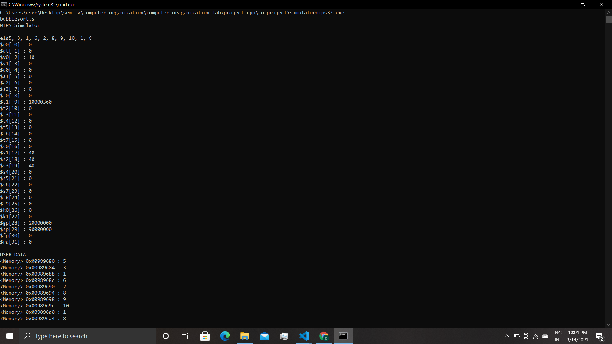

# computer organization project 
### 32 bits mips type processor simulator
i used here object oriented approach to develope this simulator
#### here we use following classes
1. registers
2. screen 
3. parser
4. execution
5. mipssimulator
