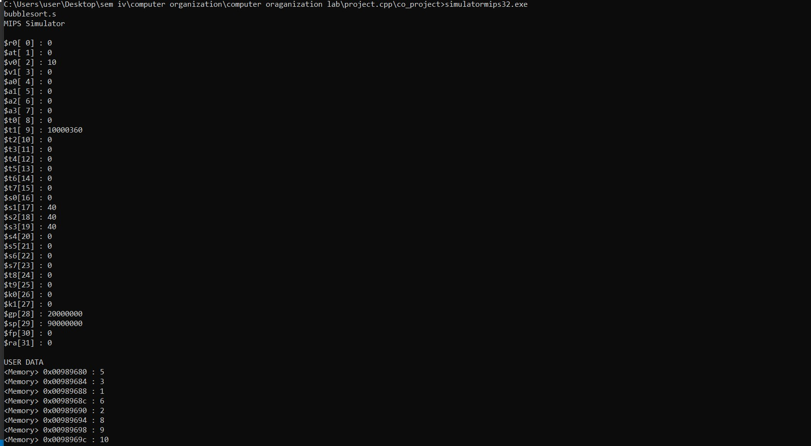
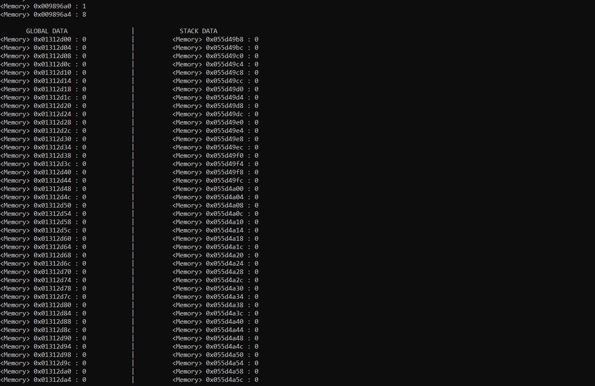

# computer organization project 
### 32 bits mips type processor simulator
i used here object oriented approach to develope this simulator
#### here we use following classes in developing this
1. registers
2. screen 
3. parser
4. execution
5. mipssimulator
## we implement here following mips instructions
#### R type
* add
* sub
* mul
* slt
#### I type
* addi
* li
#### jump type
* jump
#### branch type
* bne
* beq
#### load and store type
* la
* lw
* sw
#Instruction to run this software
1. first exexute simulatormips32.cpp file usoing any c++ compiler 
2. after execution you have to enter assembly file relative path
## we are printing these following things as output:-
1. registers and their data after all instruction exexuted
2. user memory 
3. stack pointer data
4. global pionter data

## sample output of bubble sort:-

